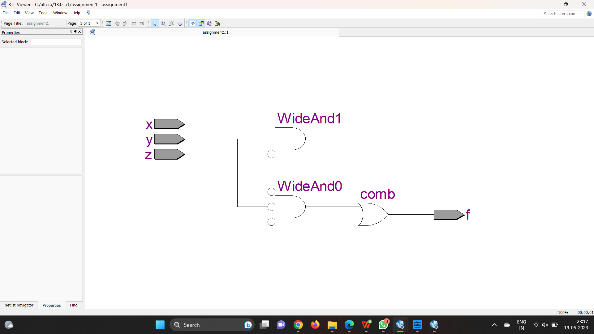
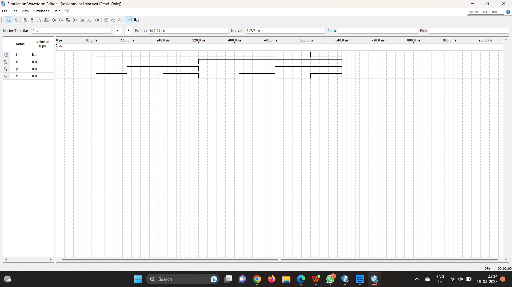

# TITLE:
Design and simulate the logic diagram using Verilog.
F=(X+Y')(X'+Y)Z'


# THEORY:
Product Of Sum:

i. POS stands for Product of Sums.

ii. It is a technique of defining boolean terms as a product of sum terms.

iii. It prefers maxterms.

iv. In the case of POS, the Maxterms are defined as ‘M’

v. It gives LOW(0) output.

vi. In POS, we can get the final term by multiplying the sum terms.

K-Map:

A Karnaugh map (K-map) is a visual method used to simplify the algebraic expressions in Boolean functions without having to resort to complex theorems or equation manipulations. A K-map can be thought of as a special version of a truth table that makes it easier to map out parameter values and arrive at a simplified Boolean expression.

# LOGIC DIAGRAM


# NETLIST DIAGRAM


# TIMING DIAGRAM


# PROGRAM
### NAME : Gumma Dileep Kumar
### REGISTER NO: 212222240032
```python
module assignment1 (x,y,z,f);
input x,y,z;
output f;
wire a,b,c,d,e;
not (a,x);
not (b,y);
not (c,z);
and (d,a,b,c);
and (e,x,y,c);
or (f,d,e);
endmodule

```

# REFERENCE
https://www.electroniclinic.com/sop-and-pos-digital-logic-designing-with-solved-examples/
